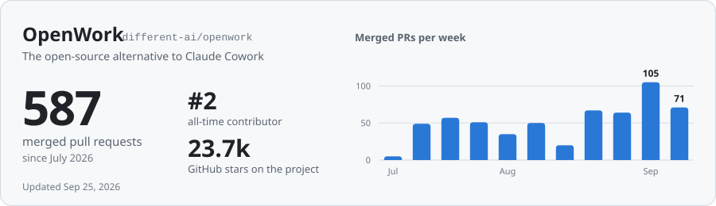
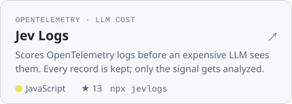
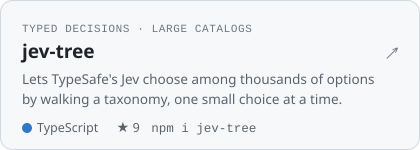
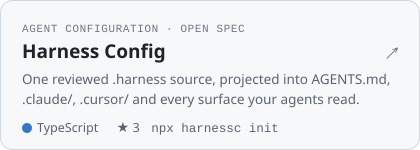
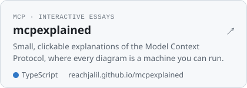
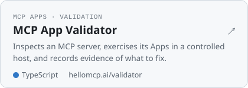
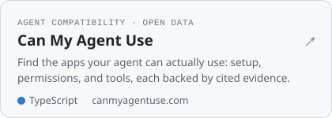
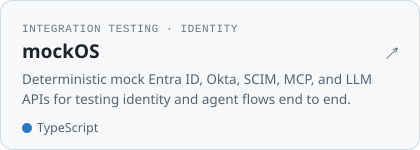
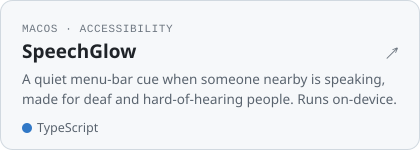

<!-- The banner, cards, and link chips are generated from data/profile.json: node scripts/render.mjs --refresh -->

<picture>
  <source media="(prefers-color-scheme: dark)" srcset="assets/hero-dark.svg">
  
</picture>

<!-- links:start -->

<a href="https://reachjalil.github.io"><picture><source media="(prefers-color-scheme: dark)" srcset="assets/links/website-dark.svg"></picture></a>
<a href="https://www.linkedin.com/in/reachjalil"><picture><source media="(prefers-color-scheme: dark)" srcset="assets/links/linkedin-dark.svg"></picture></a>
<a href="mailto:reachjalil@gmail.com"><picture><source media="(prefers-color-scheme: dark)" srcset="assets/links/email-dark.svg"></picture></a>
<a href="https://appliedintelligence.team/"><picture><source media="(prefers-color-scheme: dark)" srcset="assets/links/consulting-dark.svg"></picture></a>

<!-- links:end -->

Hi, I'm Jalil, Founding Engineer at **[OpenWork](https://github.com/different-ai/openwork)**, based in San Francisco. I like taking capabilities that are powerful but hard to use and making them simple, honest about what they're doing, and reliable enough to trust with real work.

Alongside OpenWork, I build small open-source tools for people working with agents: configuration, MCP, testing, and evals. Before agents, I spent 8+ years shipping software for enterprises and startups. That includes [BetterFormula](https://github.com/reachjalil/betterformula), a Salesforce formula editor with 13k+ users.

## Building OpenWork

[OpenWork](https://openworklabs.com) is the open-source alternative to Claude Cowork. It's a desktop app plus one MCP that let you reuse the same skills, MCP servers, and connected services across your agents, teammates, and machines. I've landed 580+ PRs there since July 2026. By commits, I'm its #2 contributor.

<a href="https://github.com/different-ai/openwork/pulls?q=is%3Apr+author%3Areachjalil+is%3Amerged">
  <picture>
    <source media="(prefers-color-scheme: dark)" srcset="assets/openwork-dark.svg">
    
  </picture>
</a>

<!-- weekly:start -->

Merged PRs per week, as a table

| Week of | Merged PRs |
| --- | ---: |
| Jul 6 | 5 |
| Jul 13 | 49 |
| Jul 20 | 57 |
| Jul 27 | 51 |
| Aug 3 | 35 |
| Aug 10 | 50 |
| Aug 17 | 20 |
| Aug 24 | 67 |
| Aug 31 | 64 |
| Sep 7 | 105 |
| Sep 14 | 71 |

<!-- weekly:end -->

Some of what I've built there:

| Area | Highlights |
| --- | --- |
| **MCP Apps** | Interactive MCP App UIs inline in conversations ([#3700](https://github.com/different-ai/openwork/pull/3700)), served through a credential-bound gateway ([#4004](https://github.com/different-ai/openwork/pull/4004)), and assembled into organization dashboards ([#4056](https://github.com/different-ai/openwork/pull/4056), [#5006](https://github.com/different-ai/openwork/pull/5006)) |
| **Connect and the MCP gateway** | An enterprise MCP client with deep diagnostics ([#2694](https://github.com/different-ai/openwork/pull/2694), [#2975](https://github.com/different-ai/openwork/pull/2975)), OAuth conformance ([#2771](https://github.com/different-ai/openwork/pull/2771)), a managed local OAuth gateway ([#3652](https://github.com/different-ai/openwork/pull/3652)), stateless MCP ([#4055](https://github.com/different-ai/openwork/pull/4055)), and Client ID Metadata Document clients ([#5293](https://github.com/different-ai/openwork/pull/5293)) |
| **Automations** | Cloud-scheduled automations that run on desktop runners ([#3466](https://github.com/different-ai/openwork/pull/3466)), automations proposed straight from chat ([#3552](https://github.com/different-ai/openwork/pull/3552)), web automations in OpenWork Cloud ([#3716](https://github.com/different-ai/openwork/pull/3716)), and saved Code Mode scripts ([#3656](https://github.com/different-ai/openwork/pull/3656)) |
| **Reliability and speed** | Live sessions that survive engine rollovers ([#3696](https://github.com/different-ai/openwork/pull/3696)), interrupted runs you can resume ([#4124](https://github.com/different-ai/openwork/pull/4124)), block-by-block streaming ([#4422](https://github.com/different-ai/openwork/pull/4422)), and virtualized long transcripts ([#5089](https://github.com/different-ai/openwork/pull/5089)) |
| **Browser and computer use** | A built-in browser for every conversation ([#4434](https://github.com/different-ai/openwork/pull/4434)), site tools with user takeover ([#4468](https://github.com/different-ai/openwork/pull/4468)), and scoped native computer-use sessions ([#4463](https://github.com/different-ai/openwork/pull/4463)) |
| **Plugins and skills** | Portable Agent Plugins end to end ([#3594](https://github.com/different-ai/openwork/pull/3594)), GitHub plugin import ([#2568](https://github.com/different-ai/openwork/pull/2568)), and organization skills served over MCP ([#2567](https://github.com/different-ai/openwork/pull/2567), [#5208](https://github.com/different-ai/openwork/pull/5208)) |
| **Cloud runtime and connectors** | A provider-neutral cloud runtime with Daytona as one adapter ([#4445](https://github.com/different-ai/openwork/pull/4445)), working Gmail, Calendar, Drive, Sheets, and Microsoft 365 actions ([#4693](https://github.com/different-ai/openwork/pull/4693)), and PDF attachments for every model ([#4334](https://github.com/different-ai/openwork/pull/4334)) |

## Open source I make

<!-- projects:start -->

<a href="https://github.com/reachjalil/jevlogs"><picture><source media="(prefers-color-scheme: dark)" srcset="assets/projects/jevlogs-dark.svg"></picture></a>
<a href="https://github.com/reachjalil/jev-tree"><picture><source media="(prefers-color-scheme: dark)" srcset="assets/projects/jev-tree-dark.svg"></picture></a>
<a href="https://github.com/reachjalil/harness-config"><picture><source media="(prefers-color-scheme: dark)" srcset="assets/projects/harness-config-dark.svg"></picture></a>
<a href="https://github.com/reachjalil/mcpexplained"><picture><source media="(prefers-color-scheme: dark)" srcset="assets/projects/mcpexplained-dark.svg"></picture></a>
<a href="https://github.com/reachjalil/mcp-app-validator"><picture><source media="(prefers-color-scheme: dark)" srcset="assets/projects/mcp-app-validator-dark.svg"></picture></a>
<a href="https://github.com/reachjalil/canmyagentuse.com"><picture><source media="(prefers-color-scheme: dark)" srcset="assets/projects/canmyagentuse-dark.svg"></picture></a>
<a href="https://github.com/reachjalil/mockos"><picture><source media="(prefers-color-scheme: dark)" srcset="assets/projects/mockos-dark.svg"></picture></a>
<a href="https://github.com/reachjalil/speechglow-mac"><picture><source media="(prefers-color-scheme: dark)" srcset="assets/projects/speechglow-mac-dark.svg"></picture></a>

<!-- projects:end -->

<b>More from the workshop</b>

 

| Project | What it is |
| --- | --- |
| [sysone](https://github.com/reachjalil/sysone) · [System One Bench](https://github.com/reachjalil/system-one-bench) | Gives an agent Jev as code (typed decisions composed in one MCP call), plus a public record of what the evidence does and doesn't show |
| [LiteMCP Composer](https://github.com/reachjalil/liteMCP) | One governed MCP endpoint for every user and agent, composed from many MCP servers |
| [skills-kit](https://github.com/reachjalil/skills-kit) | A repo-local switchboard for agent skill libraries |
| [MCP Apps gallery](https://github.com/reachjalil/openwork-mcp-app-gallery-benchmark) · [Workplace MCP Apps](https://github.com/reachjalil/workplace-mcp-apps) | Hosted, forkable MCP Apps you can try by URL and copy to build your own |
| [NottyDuck WebMCP Playground](https://github.com/reachjalil/nottyduck-webmcp-playground) | A tiny local-first playground where a person and an agent play together through WebMCP |
| [freestyle-volumes](https://github.com/reachjalil/freestyle-volumes) | Persistent volumes for Freestyle VMs, backed by any S3-compatible bucket |
| [flashpod](https://github.com/reachjalil/flashpod) | A TypeScript-first wrapper for RunPod Flash |
| [prettui](https://github.com/reachjalil/prettui) | Composable TypeScript packages for exact-frame terminal UIs |
| [web-seek](https://github.com/reachjalil/web-seek) | Browser QA briefs: demonstrate a flow in Chrome, then hand a validated brief to a QA agent |
| [SenseSight](https://github.com/reachjalil/sense-sight) | Turns robot sensor streams into 3D spatial memory you can explore in the browser |
| [BetterFormula](https://github.com/reachjalil/betterformula) | An IDE-like editor for Salesforce formulas, shipped as a browser extension with 13k+ users |

## If I open a PR on your repo

I'm on the maintainer side of a busy open-source repo every day, so I try to send the kind of PR I'd want to receive:

- **Small and focused.** One problem per PR, with no drive-by refactors or formatting churn.
- **Your conventions first.** I follow your contributing guide, code style, and commit format, and I sign the DCO or CLA if you ask.
- **A description that stands alone.** It covers the problem, the change, why it helps users, how I tested it, and what it doesn't cover.
- **Proof included.** Tests for behavior, plus screenshots or a recording for anything visual.
- **An issue first for big changes.** That way we agree on the approach before I write the code.
- **I stay for review.** I address feedback and follow up on anything I ship.

Recently merged upstream: two PRs to [Looms](https://github.com/ByteSliceHQ/looms), a TypeScript SDK for durable agents. One adds a generic evaluation kind ([#5](https://github.com/ByteSliceHQ/looms/pull/5)); the other adds `defineKind` and `createKind` for custom types ([#6](https://github.com/ByteSliceHQ/looms/pull/6)).

## Tools I reach for

`TypeScript` `Node.js` `React` `Next.js` `Astro` `Electron` `Hono` `Cloudflare Workers` `Durable Objects` `MCP` `MCP Apps` `OpenTelemetry` `Vercel AI SDK` `OpenAI · Anthropic · Gemini` `OpenAI Realtime` `Vitest` `Playwright` `GitHub Actions` `pnpm · Turborepo`

 

  San Francisco · Happy to talk about agents, MCP, and developer tools: <a href="mailto:reachjalil@gmail.com">reachjalil@gmail.com</a>

